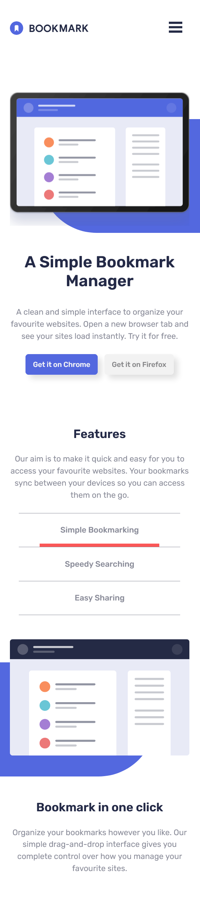
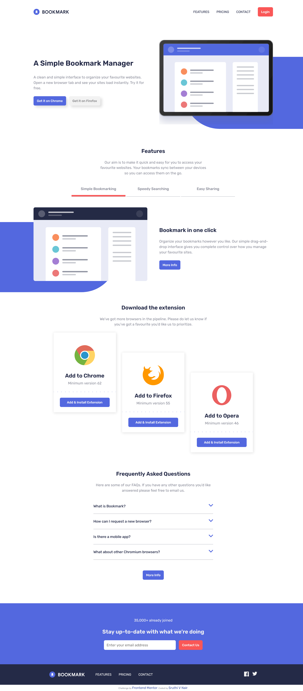

# Frontend Mentor - Bookmark Landing Page

This is my solution to the [Bookmark landing page challenge on Frontend Mentor](https://www.frontendmentor.io/challenges/bookmark-landing-page-5d0b588a9edda32581d29158).

## Table of contents

- [Overview](#overview)
  - [The challenge](#the-challenge)
  - [Screenshot](#screenshot)
  - [Links](#links)
- [My process](#my-process)
  - [Built with](#built-with)
  - [What I learned](#what-i-learned)
  - [Continued development](#continued-development)
  - [Useful resources](#useful-resources)
- [Author](#author)
- [Acknowledgments](#acknowledgments)

## Overview

### The challenge

Users should be able to:

- View the optimal layout for the site depending on their device's screen size
- See hover states for all interactive elements on the page
- Receive an error message when the newsletter form is submitted if:
  - The input field is empty
  - The email address is not formatted correctly

### Screenshot

#### Mobile View

#### Desktop View

### Links

- Solution URL: [https://github.com/sruthi-nair166/Bookmark-Landing](https://github.com/sruthi-nair166/Bookmark-Landing)
- Live Site URL: [https://sruthi-nair166.github.io/Bookmark-Landing/](https://sruthi-nair166.github.io/Bookmark-Landing/)

## My process

### Built with

- Semantic HTML5 markup
- CSS custom properties
- Flexbox
- CSS Grid
- Mobile-first workflow
- JavaScript (for tabs, FAQ, validation)

### What I learned

This project really helped me understand:

- How to structure semantic, accessible HTML
- Managing tabbed content with `aria-selected` and `role="tablist"`
- Creating collapsible FAQ sections
- Using .checkValidity() for native form validation
- How to test and optimize performance and SEO using Lighthouse

### Continued development

I want to continue refining:

- Accessibility practices like screen reader support
- Animating tab/FAQ transitions more smoothly

### Useful resources

- [MDN Web Docs](https://developer.mozilla.org/en-US/) 
- [Aria Authoring Practices Guide](https://www.w3.org/WAI/ARIA/apg/)
- [Chrome for developers Lighthouse Guide](https://developer.chrome.com/docs/lighthouse/overview/#get-started)

## Author

- Github - [@sruthi-nair166](https://github.com/sruthi-nair166)
- Frontend Mentor - [@sruthi-nair166](https://www.frontendmentor.io/profile/sruthi-nair166)

## Acknowledgments

I would like to thank Frontend Mentor and it's availability of various projects for giving me this opportunity to be able to do this project which simulates real-world specifications.
